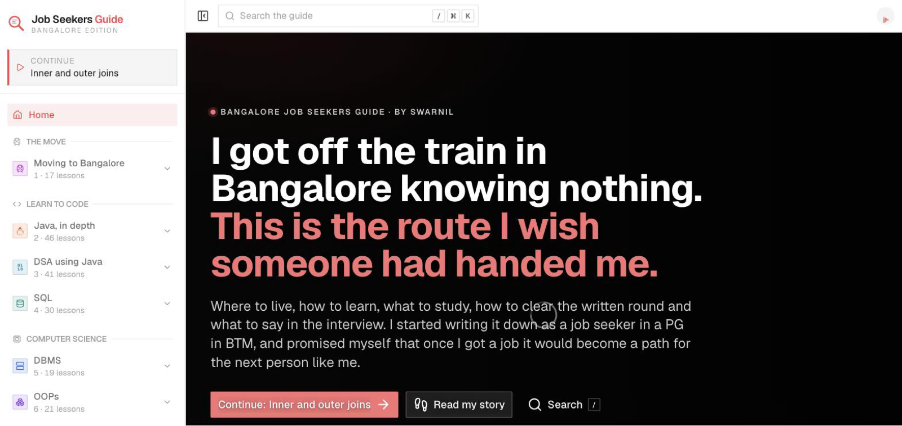
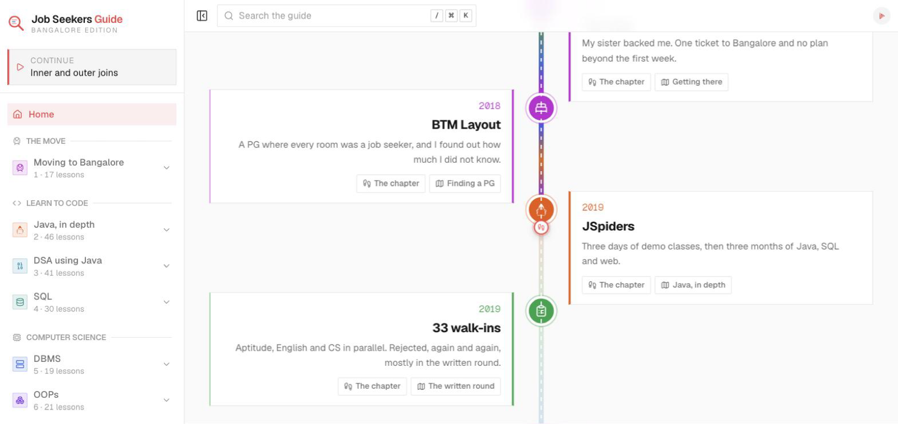
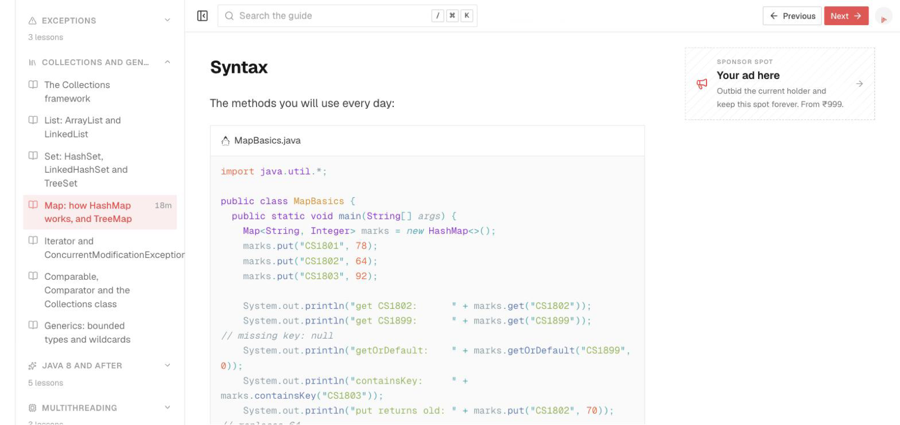
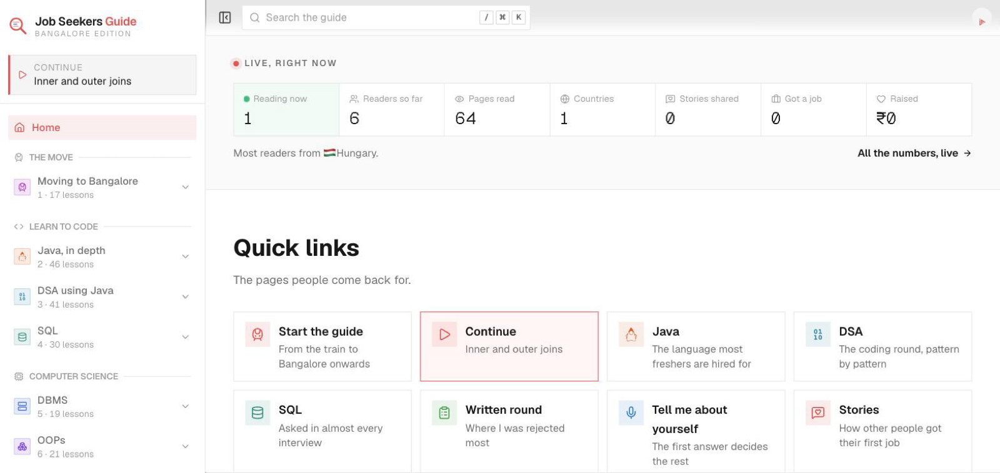
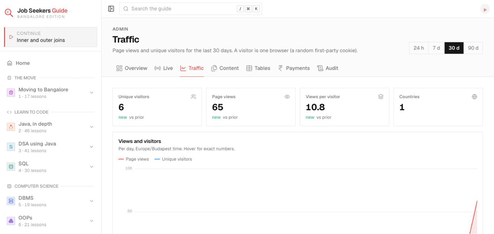

<div align="center">

# Bangalore Job Seekers Guide

**I got off the train in Bangalore knowing nothing.
This is the route I wish someone had handed me.**

[jobseekers.imswarnil.com](https://jobseekers.imswarnil.com) · free forever · no paywall · open source

[](https://jobseekers.imswarnil.com)
[](LICENSE)
[](LICENSE-CONTENT.md)
[](https://nuxt.com)
[](https://workers.cloudflare.com)
[](CONTRIBUTING.md)



</div>

## Why this exists

Every year lakhs of freshers finish an engineering degree without a job, pack
one bag, and take a train to Bangalore. Most of them are told the same thing:
join an institute, sit the walk-ins, and hope. Nobody hands them the route.

I was one of them. This is the route, written down by somebody who walked it,
with every rejection left in. It is free, it will stay free, and the code is
open so it can outlive me.

## My story, in short

**2018, Mahroni.** I finished computer science at a college in Bhopal without
ever clearing a single written round. I wanted to be a YouTuber; I needed a
job. My father wanted me to become a government teacher. My sister backed me
instead, and we decided I would go to Bangalore.

**The train.** I took the train from Mahroni with one bag. I gave a few
interviews and realised I knew nothing, so I did two things. I started
learning properly. And I started **writing the job search down**, because I
knew that when I got a job, the record would become a path for someone like me.

**BTM Layout.** A PG where every room was a job seeker. I sat three days of
demo classes at different institutes, chose JSpiders, and spent three months on
Java, SQL and web, with the core computer science subjects, aptitude and
English on my own in parallel.

**33 walk-ins.** Aptitude, English and CS, rejected again and again, mostly in
the written round. **The 34th:** one of 700 to 1000 people in the queue.
Selected.

**₹13,000 a month.** 1.8 LPA at a startup, with a bond, six days a week, no
orientation, "watch these Udemy courses". Happy, not satisfied: Sundays were for
study and more interviews.

**Accenture.** Two months later: a proper orientation, friends, and the
Salesforce stream I never asked for. I wanted web development. That is how
corporate works: you might get what you want if you fight for it.

**The switch.** Three years in, on about 5 LPA, I met a friend who had been a
job seeker with me. He had switched and was on 21 LPA. So I switched: five
offers, the best 15.5 LPA at Cognizant. Nine months of micromanagement later I
kept going, cracked PwC and Twilio, and joined Twilio at 30+ LPA as a
Salesforce analytics engineer in the GTM team.

**Europe.** After three years and more at Twilio, Education First called and
sponsored my visa. I moved. AI is changing everything now, and I am as unsure
as anyone about what comes next. That part continues at
[imswarnil.com](https://imswarnil.com).

The whole story, chapter by chapter with photos and videos, is the last part of
the guide: [**My story**](https://jobseekers.imswarnil.com/my-story).



## What is in the guide

About 400 lessons in 17 tracks, read in order:

| Part | Tracks |
| --- | --- |
| **The move** | Which city, the family conversation, a six-month budget, the train, choosing an area, finding a PG, institute or online, the 3-day demo trial, walk-ins, scams and bonds, the first offer |
| **Learn to code** | Java in depth (46) · DSA using Java (41) · SQL (30) |
| **Computer science** | DBMS · OOPs · Operating systems · Computer networks · Other subjects (SDLC, Agile, testing, Git, Linux, cloud, number systems) |
| **Web basics** | HTML · CSS · JavaScript |
| **The written round** | Quantitative aptitude · Logical reasoning · Verbal ability: every topic, what to study, why, the formulas, worked examples, a 30-day plan |
| **The interview** | Resume, tell me about yourself (with a template), how to answer a technical question, the HR round, reading an offer, negotiation, the first switch |
| **My story** | Mahroni → Bangalore → Europe, 21 chapters |

Every technical lesson has a real use case, highlighted code with a copy
button **and its real output** (the Java was run on JDK 21, the SQL on
SQLite), the trap people fall into, and the interview questions it answers.



## The app

- **Read** with a sidebar of the whole guide, progress you can tick off, a
  table of contents, and Previous / Next.
- **Search** everything with `/` or `⌘K`.
- **Share your story** at `/stories`: where you started, where you are now,
  the company and package, with photos or a video. Readers vote for the most
  inspiring ones.
- **Sign the guestbook**: what did you learn here? With GIFs.
- **Comment** under any lesson (five comments per person per page).
- **Live stats** at `/stats`: readers right now, total reach, countries, jobs
  got, all in the open.
- **Support** it with any amount, or **sponsor** it: one brand spot, held by
  the highest bid with no expiry until someone pays more, and a leaderboard of
  every sponsor.
- **Gear** I actually used in the PG, with affiliate links.
- **Your account**, which you can delete along with everything you wrote.

<p>
  
  
</p>

The admin (`/admin`) has live analytics (who is reading right now, on which
page, from where), traffic and content trends with period-over-period change,
moderation, payments, an audited table manager with filters, edits and CSV
export, and a one-click removal for the clearly labelled sample data.

| Key | Does |
| --- | --- |
| `/` or `⌘K` | Search |
| `[` | Hide or show the sidebar |
| `←` `→` or `K` `J` | Previous / next lesson |
| `M` | Mark the lesson finished |

## How it is built

| Layer | Choice |
| --- | --- |
| App | [Nuxt 4](https://nuxt.com), [Nuxt UI 4](https://ui.nuxt.com), [Nuxt Content 3](https://content.nuxt.com), Tailwind CSS 4 |
| Hosting | One [Cloudflare Worker](https://workers.cloudflare.com): lessons are prerendered static files, the community pages and API run on the Worker |
| Data | [Neon](https://neon.com) Postgres over HTTP; Cloudflare D1 for Nuxt Content; R2 for story photos and videos |
| Sign-in | [Neon Auth](https://neon.com/docs/neon-auth/overview) (Google or email) |
| Payments | [Dodo Payments](https://dodopayments.com) (pay what you want), verified webhooks |
| Analytics | First party, in our own database. No third-party trackers |

```
content/1.path/            the guide: track → chapter → lesson, numbered in order
content/products.yml       the gear page
app/                       pages, components, composables
server/api/                stories, guestbook, comments, stats, sponsors, payments, admin
db/migrations/             the Postgres schema
docs/                      api-contract.md, backend.md, screenshots
```

## Run it locally

```bash
git clone https://github.com/imswarnil/Job-Seekers-Guide.git jobseekers.imswarnil.com
cd jobseekers.imswarnil.com
pnpm install
pnpm dev                 # http://localhost:3000
```

Node 22, pnpm 11. The whole guide works with no configuration. Sign-in,
stories, payments and `/admin` need the variables in `.env.example`; without
them those pages say they are not configured instead of breaking.
`docs/backend.md` walks through Neon, Neon Auth, Dodo and Cloudflare.

```bash
pnpm check:lessons       # lesson structure, component nesting, em dashes
pnpm lint
pnpm typecheck
pnpm db:migrate          # apply db/migrations to DATABASE_URL
pnpm deploy              # build and deploy the Worker
```

## Contributing

Found a wrong answer, a typo or a broken link? Every lesson has an **Edit this
page** link, or open an issue. Got a job with the help of this guide? Share
your story at [/stories](https://jobseekers.imswarnil.com/stories); that helps
more than any pull request. See [CONTRIBUTING.md](CONTRIBUTING.md) and the
style guide in [CLAUDE.md](CLAUDE.md).

## Licence

- **Code:** [MIT](LICENSE).
- **The guide, the story, the photos and videos:**
  [CC BY-NC-SA 4.0](LICENSE-CONTENT.md). Share it, teach from it, translate it;
  credit it; do not sell it.

Nothing here promises a job, a package or a placement percentage. Prices and
institute details are what they were when I went; check today's.

## Tags

`bangalore` `job-seekers` `freshers` `it-jobs-india` `walk-in-interviews`
`java` `dsa` `sql` `dbms` `oops` `operating-systems` `computer-networks`
`aptitude` `logical-reasoning` `verbal-ability` `interview-preparation`
`hr-interview` `salary-negotiation` `btm-layout` `career-guide` `open-source`
`nuxt` `cloudflare-workers` `neon`

---

<div align="center">

Made by [Swarnil](https://imswarnil.com), who was one of the 700.
If you have lost faith: I have been there.

</div>
