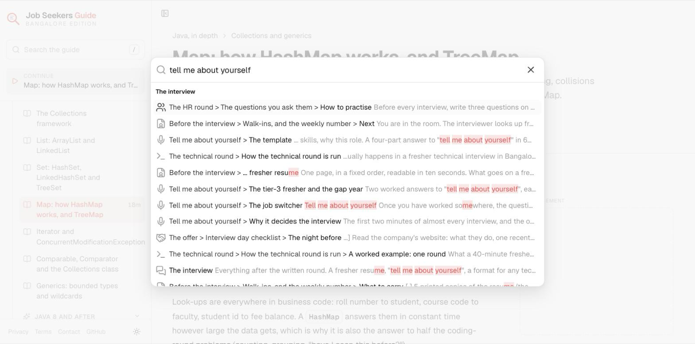
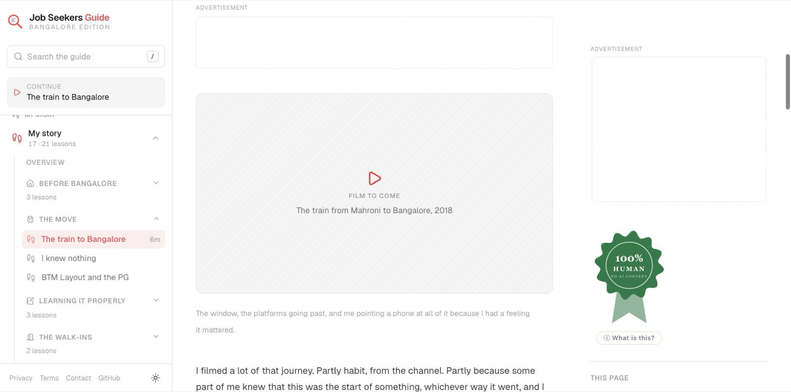
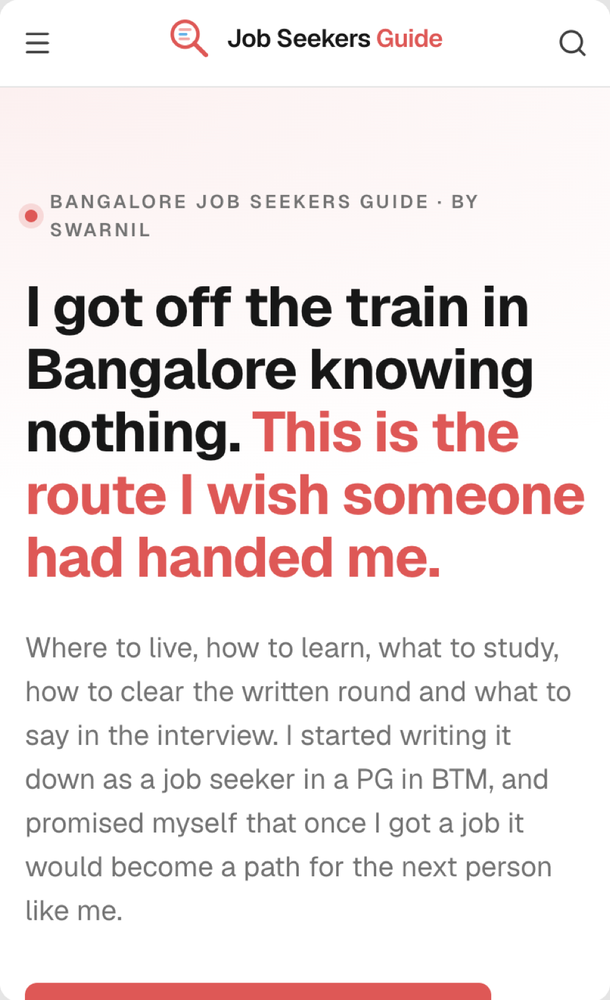

# Bangalore Job Seekers Guide

> I got off the train in Bangalore knowing nothing. This is the route I wish
> someone had handed me.

**[jobseekers.imswarnil.com](https://jobseekers.imswarnil.com)** · free · no login · no paywall


## The idea

In 2018 I graduated in computer science from a college in Bhopal having never
cleared a single written round. I wanted to be a YouTuber; I needed a job. My
father wanted me to become a government teacher. My sister backed me instead,
and I took the train from Mahroni to Bangalore.

I gave a few interviews and realised I knew nothing. So I did two things. I
started learning properly (a PG in BTM Layout, three days of demo classes at
institutes, three months of Java, SQL and web at JSpiders, and CS subjects,
aptitude and English on my own in parallel). And I started **writing the job
search down**, because I knew that once I got a job, the record would become a
path for somebody like me.

Thirty-three walk-ins said no. At the thirty-fourth, out of 700 to 1000 people,
I was selected: ₹13,000 a month at a startup, with a bond, six days a week. Two
months later, Accenture, and a Salesforce stream I never asked for. Three years
later a friend who had been a job seeker with me was on 21 LPA while I was on 5,
so I switched: five offers, 15.5 LPA at Cognizant, then PwC and Twilio at 30+
LPA, working in Salesforce analytics for the GTM team. Then Education First
sponsored my visa to Europe.

This app is that record, finished. If you are sitting in a PG right now and
have lost faith: I have been there. Nothing about me changed between the first
walk-in and the thirty-fourth except what I had practised.

## What is in it

One guide, read in order, in seven parts:

| Part | Tracks |
| --- | --- |
| **The move** | Which city, the family conversation, a six-month budget, the train, choosing an area, finding a PG, institute vs online, the 3-day demo trial, walk-ins, scams and bonds, the first offer |
| **Learn to code** | Java in depth · DSA using Java · SQL |
| **Computer science** | DBMS · OOPs · Operating systems · Computer networks · Other subjects (SDLC, Agile, testing, Git, Linux, cloud, number systems) |
| **Web basics** | HTML · CSS · JavaScript |
| **The written round** | Quantitative aptitude · Logical reasoning · Verbal ability: every topic, what to study, why, the formulas, a worked example, how to practise |
| **The interview** | Resume, tell me about yourself (with a template), how to answer a technical question, the HR round, reading an offer, negotiation, the first switch |
| **My story** | Mahroni → Bangalore → Europe, chapter by chapter, with the photos and videos from the journey |

Every technical lesson has a real use case, syntax-highlighted code with a copy
button and its real output, the trap people fall into, and the interview
questions it answers.

<p>
  
  
</p>
<p>
  
  
</p>

## It is an app, not a website

No navbar, no footer menu, no marketing pages. A sidebar with the whole guide
and your progress, search on `/` or `⌘K`, and the lesson you are reading with
previous and next. Progress lives in your browser (`localStorage`). Reading
never needs an account; one is only needed to share a story, sign the
guestbook, comment under a lesson or sponsor the guide.

| Key | Does |
| --- | --- |
| `/` or `⌘K` | Search every lesson and heading |
| `[` | Hide or show the sidebar |
| `←` `→` or `K` `J` | Previous / next lesson |
| `M` | Mark the lesson finished |

## The community around it

The guide is free. These pages are what keep it alive and let the people it
helped help the next person:

| Page | What it does |
| --- | --- |
| `/stories` | Readers post their own story (from → to, company, package, photos or video). Others vote for the most inspiring. |
| `/guestbook` | "What did you learn here?", with GIFs. |
| `/sponsor` · `/leaderboard` | Sponsor spots across the site. The highest bid holds a spot with no expiry until someone outbids it; every sponsor is ranked on the leaderboard. |
| `/support` | Pay what you want to keep the guide free (Dodo Payments). |
| `/stats` | Live visitors, reach, countries, stories and jobs got, in the open. |
| `/gear` | The notebooks, pens and books I actually used, with affiliate links. |
| `/admin` | For me: analytics, moderation, payments, the database. |

Lessons have comments (5 per person per page) and "Mark as finished"
progress. Sign-in is Neon Auth (Google or email), and deleting your account
deletes everything you wrote.

## Run it

```bash
pnpm install
pnpm dev              # http://localhost:3000
pnpm check:lessons    # structure, nesting and em dashes in every lesson
pnpm lint
pnpm build            # the Cloudflare Worker, with every lesson prerendered
pnpm db:migrate       # apply db/migrations to Neon (needs DATABASE_URL)
pnpm deploy           # build and `wrangler deploy`
```

Copy `.env.example` to `.env` for local settings; with none at all the site
still builds and renders. The server side is explained in
[`docs/backend.md`](docs/backend.md), the endpoints in
[`docs/api-contract.md`](docs/api-contract.md).

Node 22, pnpm 11.

## How it is built

- **Nuxt 4**, **Nuxt UI 4**, **Nuxt Content 3**, Tailwind CSS 4, on the Im
  Design System's type and colour.
- **Prerendered, on Cloudflare Workers.** Every lesson is prerendered and served
  as a static file; a Worker serves the API and the community pages (stories,
  guestbook, comments, stats, sponsors, support). Neon Postgres for data, Neon
  Auth for sign-in, Dodo Payments for money, first-party analytics only.
  Deployed by `.github/workflows/deploy.yml` on every push to `main`.
- **The folder tree is the guide.** `content/1.path/<track>/<chapter>/<lesson>.md`,
  and the numeric prefixes are the order. Reordering the guide is a `git mv`.
- **Code runs in your browser** for JavaScript and SQL. Java is shown with its
  real output.

```
content/1.path/
├── 00.bangalore/            /bangalore        the move
├── 01.java/                 /java
├── 02.dsa/                  /dsa
├── 03.sql/                  /sql
├── 04.dbms/ … 11.other-subjects/
├── 12.quantitative-aptitude/ 13.logical-reasoning/ 14.verbal-ability/
├── 15.interview/            /interview
└── 16.my-story/             /my-story
```

Writing rules (the narrator, the page shapes, the components) are in
[`CLAUDE.md`](CLAUDE.md). The plan and what is left are in
[`to-do.md`](to-do.md).

## Adding the photos and videos

Every story chapter reserves space for the real media with a placeholder:

```md
::story-media{kind="video" label="The train from Mahroni to Bangalore, 2018"}
::
```

Put the file in `public/images/story/` (or a video URL) and add
`src="/images/story/train.mp4"`. Nothing else moves.

## Tags

`bangalore` `job-seekers` `freshers` `it-jobs-india` `walk-in-interviews`
`java` `dsa` `sql` `dbms` `oops` `operating-systems` `computer-networks`
`aptitude` `logical-reasoning` `verbal-ability` `interview-preparation`
`hr-interview` `salary-negotiation` `btm-layout` `jspiders` `career-guide`
`nuxt` `nuxt-content` `cloudflare-workers` `neon`

## Licence and honesty

The guide is free and stays free. Nothing here promises a job, a package or a
placement percentage; prices and institute details are what they were when I
went, and you should check today's. Ads (AdSense) pay for the domain.

Made by [Swarnil](https://imswarnil.com), who was one of the 700.
